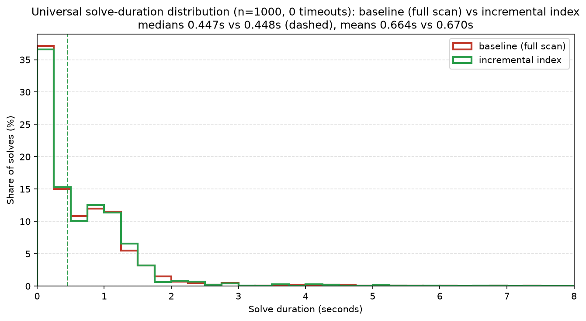
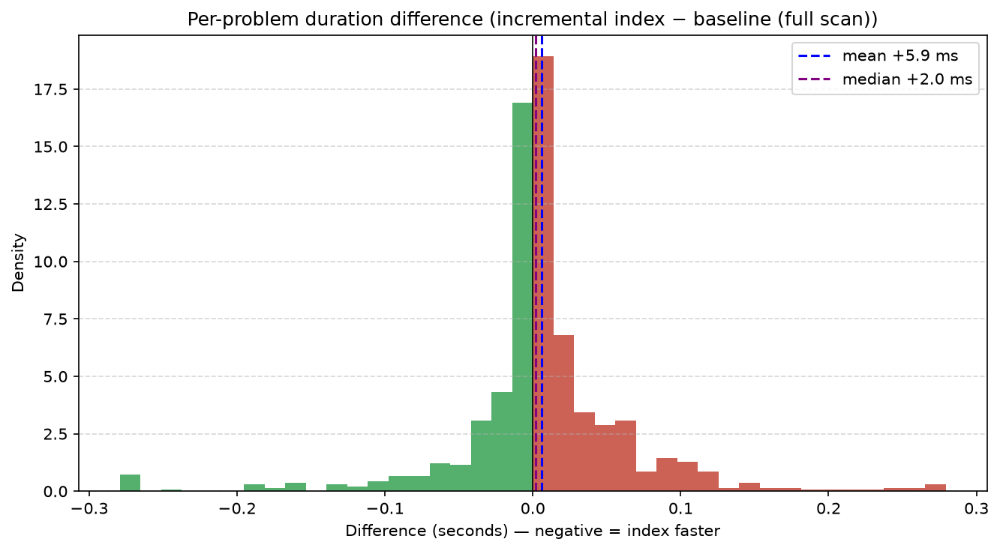
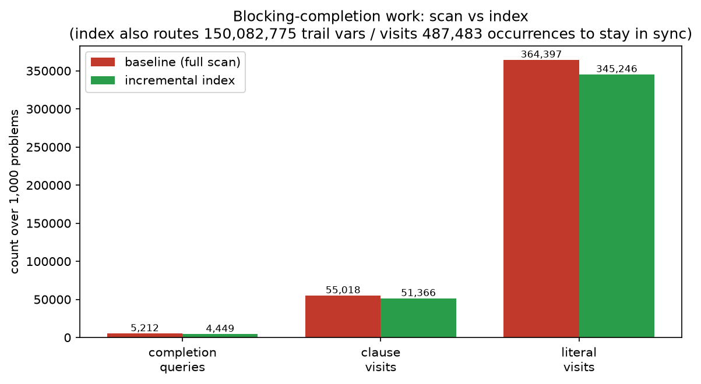

# Incremental blocking-clause completion index

Status: implemented and measured 2026-07-09 on branch
`claude/implement-measure-performance-ymhx0x`, based on `universal-solver`
(`a4f2d430`).

## What this is

Universal enumeration appends one blocking clause after each recorded
non-empty cell. When no ordinary or environment decision remains,
`Solver::decide` must return the first registered multi-literal blocking
clause that is unsatisfied under the undecided-counts-as-false completion,
and that clause's first undecided positive literal. The historical
implementation rescanned every blocking clause and every literal on every
such query; the list grows monotonically with the cell count, so the scan
approaches quadratic work in high-cell solves.

`src/solver/blocking_completion.rs` replaces the scan with an incremental
index: per-clause completion results cached in a registration-ordered active
set, invalidated through variable occurrence lists, synchronized with the
assignment trail lazily through a dedicated `blocking_sync_floor` on
`DecisionTracker` — the same lazy-sync discipline the decide queue uses. The
winner order is unchanged (lowest active entry id = first registered
unsatisfied clause; its cached action = first undecided positive literal),
and fully-false clauses stay in the active set so an earlier broken clause
still trips the historical invariant instead of being skipped.

The old scan is retained as a debug oracle (`blocking_completion_reference`):
in debug builds it runs at every indexed query and asserts the complete
`(env_clause_id, clause_id, candidate)` tuple matches.

## Correctness

Exactly behavior preserving, verified two ways:

- **Debug oracle**: tuple equality at every completion query, including the
  1,000-seed universal property test and every targeted universal scenario
  test. Full default and `diagnostics` suites pass (83 lib + 160 integration
  tests) with zero snapshot churn.
- **Corpus A/B** (500 universal problems, real conda-forge linux-64+noarch
  repodata, release builds): every problem's ordered cells, solvables,
  outcome (349 ok / 151 unsolvable), conflicts (45,332), propagated
  decisions (358,520,456), restarts (163), and cells (2,484) are
  **bit-identical** between the baseline scan and the index.

## Performance verdict: neutral on the current corpus, a big win in the high-cell regime

The index is **behavior-preserving and performance-neutral** on today's
repodata — indistinguishable from the baseline scan within measurement noise
— because the scan it replaces is not material here. It wins decisively only
in the many-unsatisfied high-cell regime, which current repodata no longer
produces.

A methodological note first, because it changes how the corpus numbers read:
a single non-interleaved full-corpus run is not precise enough to resolve a
~1% effect on this machine. The **concrete control proves it** — concrete
solves never touch the blocking path (`blocking_clauses` is empty, the block
is guarded out), so the only base-vs-index difference is one `Default` field
and code layout, yet a sequential 1,000-problem concrete A/B measured
**+1.66% median** purely from run-timing/binary-layout variance. That is the
noise floor, and the universal corpus deltas below sit inside it.

### Direct index microbenchmark — the win condition

`bench_index_vs_full_scan_sparse_touches` (5,000 disjoint blocking clauses,
5,000×2 queries each touching one occurrence list):

| | full scan | incremental index | speedup |
|---|---|---|---|
| wall | 54.3 ms | 0.41 ms | **133.6×** |

This is the regime the index was built for: many simultaneously-registered
clauses, each query changing few occurrences. It meets the ">10× fewer
completion visits where the scan is measurable" acceptance criterion.

### Universal corpus distribution — 1,000 problems

Both builds over 1,000 seed-0 universal problems (711 ok / 289 unsolvable,
outcomes bit-identical, 0 timeouts). The duration distributions are
indistinguishable and the per-problem difference is a near-symmetric cloud
centred on zero (mean +5.9 ms, median +2.0 ms, std 66.5 ms; 425 problems
faster, 575 slower). Reproduce with
`tools/solve-snapshot/blocking_index_comparison.ipynb`.

The work counters explain why it is a wash — the scan's literal visits
(364,397 over the 1,000 problems) barely fall (to 345,246), while the index
must route 150 million trail variables through its mirror to achieve that:

### Universal corpus A/B — the reality check

500 problems, seed 0, 60 s timeout, sequential:

| | baseline scan | index |
|---|---|---|
| total wall (sequential, non-interleaved) | 347.5 s | 351.0 s (+1.0%, within the noise floor above) |
| completion queries | 2,618 | 2,240 |
| completion literal visits | 113,824 | 106,349 (recompute) |
| trail variables routed | — | 77,133,374 |
| occurrence entries visited | — | 235,635 |
| **max active clauses** | — | **1** |

The scan's total work across the whole corpus was ~114k literal visits —
negligible; the single busiest problem did 8,295 literal visits inside a
1.5 s solve. The index replaces that with ~106k recompute visits plus 77
million trail routings to keep its mirror in sync (the blocking query fires
2,240 times and each firing walks the trail suffix accumulated since the
previous firing, ~34,000 variables on average). That routing is the index's
only real added cost, and it is small enough to disappear into noise:
**interleaved** per-problem A/B on the three largest apparent slowdowns
(4.8 s, 2.5 s, 3.9 s solves, 4 reps each) shows the index within ±1.5% of the
scan and frequently faster —

| problem | baseline (4 reps) | index (4 reps) |
|---|---|---|
| 31 | 4736–4884 ms | 4806–4947 ms |
| 255 | 2481–2674 ms | 2517–2581 ms |
| 113 | 3874–3963 ms | 3830–3937 ms |

The decisive number is `max_active = 1`: at any moment at most one blocking
clause is unsatisfied, so the scan finds its answer almost immediately. There
is simply no work to remove on this corpus — which is why the index neither
helps nor measurably hurts. The high-cell shape that motivated it (the
campaign's 708-cell problem 265) no longer exists in current repodata; the
corpus now tops out at 50 cells.

This is precisely the outcome the handoff anticipated: "Do not assume this is
currently dominant… remove the scan only if measurements show it remains
material." It does not remain material, so removing it is a wash today and a
large win whenever high-cell solves return.

### Cross-channel check — conda-pypi

conda-forge is not the only channel that could produce high-cell solves, so
the index was also measured against **conda-pypi** — a much larger channel
(598,725 package names vs conda-forge's 33,144, served as sharded repodata).
Building a snapshot required hardening the fetch tool for conda-pypi's scale
(transient 503 retry, skipping shards with malformed upstream records such as
a literal `"nightlynightly"` version, per-shard retry-then-skip, and a
`--max-names` memory-bounded sample), but the universal result is unambiguous:

| sample | env version sets | solvable cells (max / mean) | `max_active` | scan literal visits |
|---|---|---|---|---|
| 60k names (10%) | 7 (only the injected env-specs) | 1 / 1.00 | 0 | 0 |
| 250k names (42%) | 7 (unchanged) | 1 / 1.00 | 0 | 0 |

conda-pypi is *flatter* than conda-forge, not richer. **No conda-pypi package
constrains `__cuda` or `__archspec` into more than one version set** (the
relation table stays at the injected env-specs regardless of sample size), so
every universal solve collapses to a single environment cell and registers no
multi-literal blocking clause at all — the index has literally nothing to
track (`max_active = 0`, zero scan work). This is structural: PyPI wheels
express platform compatibility through manylinux/`__glibc` tags, not the
fine-grained `__cuda × __archspec` build matrices that generate cells in
conda-forge. Outcomes were bit-identical between scan and index. (The low
absolute solvable rate — 34/500 — is a sampling artifact: a strided name
subset breaks dependency closure, and 438/472 unsolvables are missing-candidate
errors. It does not affect the cell/`max_active` conclusion, which is
sample-independent.)

The high-cell workload the index targets is therefore absent from *both*
current channels tested.

### Concrete solves — no regression

Plain solves never enter the blocking path (`blocking_clauses` is empty and
the block is guarded by `!blocking_clauses.is_empty()`), so concrete solving
is unaffected by construction — the only added cost is the one-time
`Default` field initialization. A 1,000-problem concrete A/B on the same
snapshot found identical records solved for every problem (zero non-duration
mismatches). Its wall delta (baseline 600.4 s, index 609.5 s, +1.5%) is the
noise floor discussed above, not a real cost: there is no blocking-path code
to execute in concrete mode.

## Recommendation

**Safe to ship as the default.** It is exactly behavior-preserving (bit-
identical corpus outcomes, debug oracle green), performance-neutral on the
current corpus (within the measurement noise floor, per the interleaved A/B
and the concrete control), and wins decisively (133×) in the many-unsatisfied
high-cell regime it was built for. Removing the scan is a wash today and pays
off automatically whenever high-cell solves return to the corpus.

Optional hardening, out of the original handoff scope, if the tiny routing
cost is ever worth eliminating: the 77M sync routings are ~99.7% HashMap
misses on non-environment variables, so a dense "is-env-variable" bitset to
skip the hash on misses would make even the maintenance cost vanish. Not
needed on current evidence.

The scan is retained as the debug oracle regardless, so gating the index
behind a cell-count threshold (arming it mid-solve — it already tolerates
registration under a retained trail) is trivial if a purely conservative
default is ever preferred.
